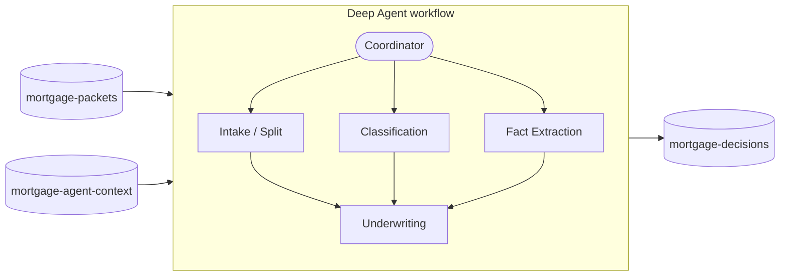

# Mortgage Processing with Deep Agents and Azure Blob Storage

This sample processes a synthetic mortgage packet with one Deep Agent acting as the
coordinator for four specialist subagents. It demonstrates durable filesystem routes,
Blob-backed `AGENTS.md` and skills, read-only evidence, and verified run artifacts.

## What you will learn

- Map separate Blob containers into one agent filesystem with `CompositeBackend`.
- Load packet evidence, `AGENTS.md`, and specialist skills directly from Blob Storage.
- Isolate each run's output under its own Blob prefix.
- Protect source and guidance blobs with read-only agent filesystem permissions.
- Read generated artifacts back from Blob Storage before reporting success.

## Workflow

The coordinator delegates one mortgage packet through four stages:

1. **Packet intake** checks completeness and writes a packet index.
2. **Document classification** identifies every document in the packet.
3. **Fact extraction** records supported financial and property facts with source paths.
4. **Underwriting** applies the included policy and writes a cited decision.

The first three stages can run independently. Underwriting begins after the packet index and
extracted facts are available.

## Quickstart

1. Install [uv](https://docs.astral.sh/uv/getting-started/installation/) and Python 3.11+.
2. From the repository root, enter the sample directory and copy the environment template:

    ```bash
    cd samples/deepagents-storage-backend/mortgage-processing
    cp mortgage-processing.env.example .env
    ```

    Set the Storage account URL and model configuration in `.env`.

3. Sign in and choose either the headless or browser command:

    ```bash
    az login

    # Process one packet and print the decision.
    uv run --env-file .env app.py

    # Or start the browser experience.
    uv run --env-file .env app.py --serve
    ```

For the browser experience, open <http://127.0.0.1:8001> and select **Process packet**.

The browser shows live subagent delegation, Blob read/write paths, completed handoffs, and
verified artifacts.

## Configuration

Set the Storage account URL and model name:

```env
AZURE_STORAGE_ACCOUNT_URL=https://<account>.blob.core.windows.net
MODEL_NAME=<model-or-deployment-name>
```

When using an Azure-hosted model, also set one supported endpoint:

```env
AZURE_AI_PROJECT_ENDPOINT=https://<resource>.services.ai.azure.com/api/projects/<project>
```

`AZURE_AI_OPENAI_ENDPOINT` and `AZURE_OPENAI_ENDPOINT` are also supported. For another model
provider, use a provider-qualified `MODEL_NAME` and configure that provider's credentials.

The Blob layout has usable defaults and supports environment overrides:

```env
MORTGAGE_PACKET_ID=MORT-2026-0042
AZURE_STORAGE_MORTGAGE_SOURCE_CONTAINER=mortgage-packets
AZURE_STORAGE_MORTGAGE_GUIDANCE_CONTAINER=mortgage-agent-context
AZURE_STORAGE_MORTGAGE_OUTPUT_CONTAINER=mortgage-decisions
MORTGAGE_DEMO_TIMEOUT_SECONDS=180
```

The source and output prefixes default to `MORTGAGE_PACKET_ID`. Set
`AZURE_STORAGE_MORTGAGE_SOURCE_PREFIX` or `AZURE_STORAGE_MORTGAGE_OUTPUT_PREFIX` only when a
Blob destination should differ.

### Run with Azurite

Start the local Blob emulator using the parent sample's
[Azurite instructions](../README.md#running-against-the-azurite-emulator), set
`AZURE_STORAGE_CONNECTION_STRING` instead of `AZURE_STORAGE_ACCOUNT_URL`, and run the same
commands above.

## Resources and permissions

At startup, the sample checks whether each container and bundled blob already exists. It
creates or uploads only missing resources and never replaces or deletes existing blobs.

With the default configuration, the sample prepares these Azure Blob Storage containers:

- `mortgage-packets` container: the bundled packet under `MORT-2026-0042/`.
- `mortgage-agent-context` container: `AGENTS.md` and the four specialist skill directories.
- `mortgage-decisions` container: verified run artifacts under
  `MORT-2026-0042/<run-id>/`.

Container names, packet ID, and prefixes can be changed through the configuration values
above.

For initial setup, the signed-in identity needs **Storage Blob Data Contributor**. After the
resources exist, it needs **Storage Blob Data Reader** on the packet and guidance containers
and **Storage Blob Data Contributor** on the output container.

## Architecture

The coordinator delegates intake, classification, and fact extraction in parallel, then
hands their results to underwriting. Blob containers provide durable packet evidence and
agent guidance, and store the artifacts produced by each run.



### Blob backend layout

Each processing run uses three Blob-backed filesystem roots (default resource names shown):

```python
source_backend = AzureBlobBackend(
  account_url=account_url,
  container_name="mortgage-packets",
  prefix="MORT-2026-0042/",
)
guidance_backend = AzureBlobBackend(
  account_url=account_url,
  container_name="mortgage-agent-context",
)
output_backend = AzureBlobBackend(
  account_url=account_url,
  container_name="mortgage-decisions",
  prefix=f"MORT-2026-0042/{run_id}/",
)

backend = CompositeBackend(
  default=StateBackend(),
  routes={
    "/source/": source_backend,
    "/guidance/": guidance_backend,
    "/output/": output_backend,
  },
)
```

`StateBackend` is the default for temporary agent files outside the three routed paths.
Packet evidence, guidance, and outputs use explicit Blob routes so those files remain
durable, while unrelated working files stay in the current agent run state.

### Blob storage layout

With the default settings, the routed files land in Azure Blob Storage as follows:

```text
mortgage-packets/
└── MORT-2026-0042/
  ├── packet-manifest.json
  ├── loan-application.json
  ├── income-verification.txt
  ├── bank-assets.csv
  ├── property-appraisal.md
  └── underwriting-policy.md

mortgage-agent-context/
├── AGENTS.md
└── skills/
  ├── packet-intake/SKILL.md
  ├── document-classification/SKILL.md
  ├── mortgage-fact-extraction/SKILL.md
  └── mortgage-underwriting/SKILL.md

mortgage-decisions/
└── MORT-2026-0042/<run-id>/
  ├── 01-packet-index.json
  ├── 02-classification.json
  ├── 03-extracted-facts.json
  └── 04-underwriting-decision.md
```

The agent sees these locations as one virtual filesystem:

- `/source/` is read-only packet evidence backed by
  `mortgage-packets/MORT-2026-0042/`. It contains the manifest, application, financial
  documents, appraisal, and underwriting policy.
- `/guidance/` is read-only agent context backed by `mortgage-agent-context/`. The main
  agent loads `/guidance/AGENTS.md`, and specialists load skills from
  `/guidance/skills/`.
- `/output/` is the writable artifact directory backed by
  `mortgage-decisions/MORT-2026-0042/<run-id>/`. Specialists write the packet index,
  classification, extracted facts, and final underwriting decision here.
- Any path outside those routes uses `StateBackend` and exists only in the current agent
  run.

The application reads all four `/output/` files back from Blob Storage before reporting
success.

## Project structure

- [`app.py`](app.py) creates input and output Blob backends in focused helpers, maps their
  virtual routes, and injects initialized dependencies into the optional server.
- [`bootstrap.py`](bootstrap.py) loads settings, creates missing containers, and seeds sample
  files.
- [`AGENTS.md`](AGENTS.md) gives the coordinator sequencing and evidence conventions.
- [`skills/`](skills/) contains each specialist procedure and output contract.
- [`server/main.py`](server/main.py) adapts injected resources and processing callbacks to
  FastAPI without importing the agent application.
